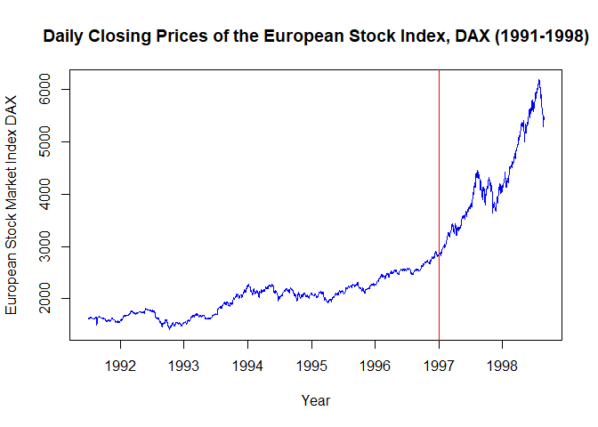
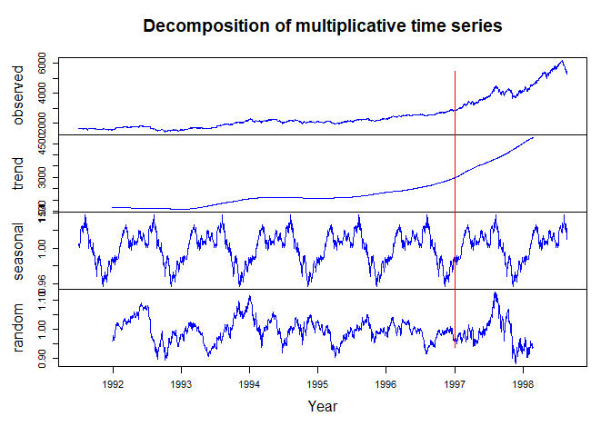
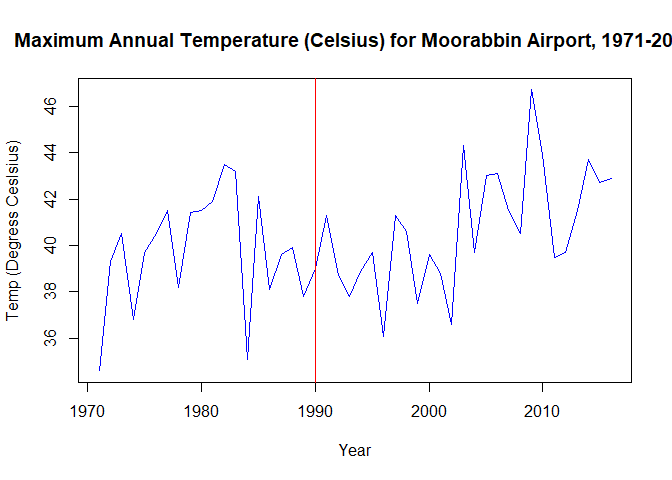
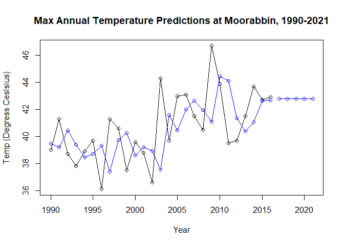

# Homework Assignment 12 -- Time Series

Loading Libraries

```r
library(dygraphs)
library(forecast)
library(fpp2)
```

```
## Loading required package: ggplot2
```

```
## Loading required package: fma
```

```
## Loading required package: expsmooth
```

### 1. Warm Up: Brief Financial Data, European Stock Market DataSets

a. European Stock Market Data Information

```r
help("EuStockMarkets")
```


```r
str(EuStockMarkets)
```

```
##  Time-Series [1:1860, 1:4] from 1991 to 1999: 1629 1614 1607 1621 1618 ...
##  - attr(*, "dimnames")=List of 2
##   ..$ : NULL
##   ..$ : chr [1:4] "DAX" "SMI" "CAC" "FTSE"
```

Create dataset from the DAX Index

```r
Eu_DAX <- EuStockMarkets[, "DAX"]
```

b. Plot of European Stock Market Data with an Indication at 1997

```r
plot(Eu_DAX, col="blue", main="Daily Closing Prices of the European Stock Index, DAX (1991-1998)", ylab="European Stock Market Index DAX", xlab="Year")
abline(v=1997, col="red")
```

<!-- -->

c. Decomposition of DAX Index Time Series into its components (multiplicative model)

```r
EuDaxComp <- decompose(Eu_DAX, type = "multiplicative")
plot(EuDaxComp, col="blue", ylab="Component", xlab="Year" )
abline(v=1997, col="red")
```

<!-- -->


### 2. Temperature Data (maxTemp)

a. Information about the maxtemp dataset

```r
help("maxtemp")
```


```r
str(maxtemp)
```

```
##  Time-Series [1:46] from 1971 to 2016: 34.6 39.3 40.5 36.8 39.7 40.5 41.5 38.2 41.4 41.5 ...
##  - attr(*, "names")= chr [1:46] "1971" "1972" "1973" "1974" ...
```

```r
plot(maxtemp, col="blue", main="Maximum Annual Temperature (Celsius) for Moorabbin Airport, 1971-2016", xlab="Year", ylab="Temp (Degress Ceslsius)")
abline(v=1990, col="red")
```

<!-- -->


b. Eliminating data before the year 1990

```r
temp_1990 <- window(maxtemp, start=1990)
```

c. Maximum Temperature Predictions for the Next 5 Years in Melbourne.  

```r
# After careful analysis it was found that setting the alpha to 0.6 produced the best 
# predicted value line
fit1 <- ses(temp_1990, alpha=0.6, initial = "simple", h=5)
plot(fit1, PI=FALSE, ylab="Temp (Degress Ceslsius)", xlab="Year", main="Max Annual Temperature Predictions at Moorabbin, 1990-2021", fcol = "white", type = "o")
```

<!-- -->
