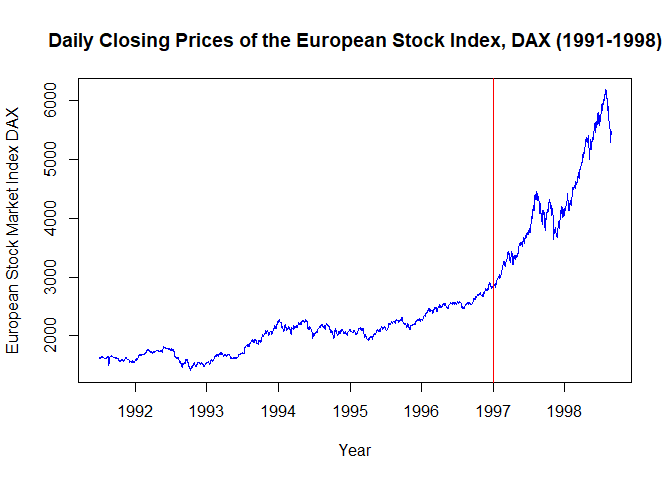
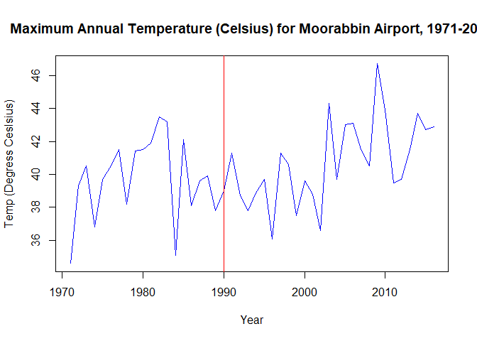

# Homework Assignment 12 -- Time Series

Loading Libraries

```r
library(dygraphs)
library(forecast)
library(fpp2)
```

```
## Loading required package: ggplot2
```

```
## Loading required package: fma
```

```
## Loading required package: expsmooth
```

```r
library(xts)
```

```
## Loading required package: zoo
```

```
## 
## Attaching package: 'zoo'
```

```
## The following objects are masked from 'package:base':
## 
##     as.Date, as.Date.numeric
```

### 1. Warm Up: Brief Financial Data, European Stock Market DataSets

a. European Stock Market Data Information

```r
help("EuStockMarkets")
```


```r
str(EuStockMarkets)
```

```
##  Time-Series [1:1860, 1:4] from 1991 to 1999: 1629 1614 1607 1621 1618 ...
##  - attr(*, "dimnames")=List of 2
##   ..$ : NULL
##   ..$ : chr [1:4] "DAX" "SMI" "CAC" "FTSE"
```

Create dataset from the DAX Index

```r
Eu_DAX <- EuStockMarkets[, "DAX"]
```

b. Plot of European Stock Market Data with an Indication at 1997

```r
plot(Eu_DAX, col="blue", main="Daily Closing Prices of the European Stock Index, DAX (1991-1998)", ylab="European Stock Market Index DAX", xlab="Year")
abline(v=1997, col="red")
```

<!-- -->

c. Decomposition of DAX Index Time Series into its components (multiplicative model)

```r
EuDaxComp <- decompose(Eu_DAX, type = "multiplicative")
plot(EuDaxComp, col="blue", ylab="Component", xlab="Year" )
abline(v=1997, col="red")
```

<!-- -->


### 2. Temperature Data (maxTemp)

a. Information about the maxtemp dataset

```r
help("maxtemp")
```


```r
str(maxtemp)
```

```
##  Time-Series [1:46] from 1971 to 2016: 34.6 39.3 40.5 36.8 39.7 40.5 41.5 38.2 41.4 41.5 ...
##  - attr(*, "names")= chr [1:46] "1971" "1972" "1973" "1974" ...
```

```r
plot(maxtemp, col="blue", main="Maximum Annual Temperature (Celsius) for Moorabbin Airport, 1971-2016", xlab="Year", ylab="Temp (Degress Ceslsius)")
abline(v=1990, col="red")
```

<!-- -->


b. Eliminating data before the year 1990

```r
temp_1990 <- window(maxtemp, start=1990)
```

c. Maximum Temperature Predictions for the Next 5 Years in Melbourne, Simple Exponential Smoothing.  

```r
# After careful analysis it was found that setting the alpha to 0.6 produced the best 
# predicted value line
fit1 <- ses(temp_1990, alpha=0.6, initial = "optimal", h=5)
plot(fit1, PI=FALSE, ylab="Temp (Degress Ceslsius)", xlab="Year", main="Max Annual Temperature Predictions at Moorabbin, 1990-2021", fcol = "white", type = "o")
lines(fitted(fit1), col="blue", type="o")
lines(fit1$mean, col="blue", type="o")
```

<!-- -->

d. Maximum Temperature Predictions for the Next 5 Years in Melbourne, Holt's Linear Trend.

```r
fit2 <- holt(temp_1990, alpha = 0.8, beta = 0.2, initial = "optimal", damped = TRUE, h = 5)
plot(fit2, PI=FALSE, ylab="Temp (Degress Ceslsius)", xlab="Year", main="Max Annual Temperature Predictions at Moorabbin, 1990-2021 (Holt)", fcol = "white", type = "o")
lines(fitted(fit2), col="blue", type="o")
lines(fit2$mean, col="blue", type="o")
```

<!-- -->

 * AICc for the fitted Model, fit2

```r
fit2$model$aicc
```

```
## [1] 157.9802
```

e. AICc Comparison
 * AICc for the fitted Model, fit1

```r
fit1$model$aicc
```

```
## [1] 144.2461
```

 * AICc for the fitted Model, fit2

```r
fit2$model$aicc
```

```
## [1] 157.9802
```

 * The AICc value for the model that utilizes, Simple Expotential Smoothing (fit1), is 144.2461, and the AICc for the model that utilizes Holt's Linear Trend method (fit2), is 157.9802. The accepted convention is to choose the model that has the lowest AICc value. Based on that convention, the best model is fit1 because it's AICc value is the lowest, at 147.2461.
 
### 3.	The Wands Choose the Wizard 
a. Dygraphs library loaded at the top of this RMarkdown document.
 * Reading in the 2 datasets.

```r
ollivander <- read.csv(file = "Unit11TimeSeries_Ollivander.csv", col.names = c("Year", "Wands_Sold"))
gregorovitch <- read.csv(file = "Unit11TimeSeries_Gregorovitch.csv", col.names = c("Year", "Wands_Sold"))
```

* Structure of each Data Frame

```r
str(ollivander)
```

```
## 'data.frame':	47 obs. of  2 variables:
##  $ Year      : Factor w/ 47 levels "1/1/1971","1/1/1972",..: 1 2 3 4 5 6 7 8 9 10 ...
##  $ Wands_Sold: int  1304 1168 1252 1296 1458 1443 1282 1450 1338 1063 ...
```

```r
str(gregorovitch)
```

```
## 'data.frame':	47 obs. of  2 variables:
##  $ Year      : Factor w/ 47 levels "1/1/1971","1/1/1972",..: 1 2 3 4 5 6 7 8 9 10 ...
##  $ Wands_Sold: int  1295 1349 1298 1493 1432 1431 1291 1247 1403 1188 ...
```

b. Converting the "Year" column in each Data Frame to Date Class

```r
ollivander$Year <- as.Date(ollivander$Year, "%d/%m/%Y")
gregorovitch$Year <- as.Date(gregorovitch$Year, "%m/%d/%Y")
```

* Structure of each Data Frame

```r
str(ollivander)
```

```
## 'data.frame':	47 obs. of  2 variables:
##  $ Year      : Date, format: "1971-01-01" "1972-01-01" ...
##  $ Wands_Sold: int  1304 1168 1252 1296 1458 1443 1282 1450 1338 1063 ...
```

```r
str(gregorovitch)
```

```
## 'data.frame':	47 obs. of  2 variables:
##  $ Year      : Date, format: "1971-01-01" "1972-01-01" ...
##  $ Wands_Sold: int  1295 1349 1298 1493 1432 1431 1291 1247 1403 1188 ...
```

c. Create Time Series from the Ollivander and Gregorovitch Data Frames

```r
ollie_ts <- xts(ollivander$Wands_Sold, order.by = ollivander$Year)
greg_ts <- xts(gregorovitch$Wands_Sold, order.by = gregorovitch$Year)
```

d. Binding the Time Series (xts) to each other, and DyGraph Creation

```r
# Merge or Bind the two time series together
ollie_greg <- merge(ollie_ts, greg_ts)

# Structure of combined Time Series
str(ollie_greg)
```

```
## An 'xts' object on 1971-01-01/2017-01-01 containing:
##   Data: int [1:47, 1:2] 1304 1168 1252 1296 1458 1443 1282 1450 1338 1063 ...
##  - attr(*, "dimnames")=List of 2
##   ..$ : NULL
##   ..$ : chr [1:2] "ollie_ts" "greg_ts"
##   Indexed by objects of class: [Date] TZ: UTC
##   xts Attributes:  
##  NULL
```

#### Dygraph of the Number of Wands Sold by Ollivander and Gregorovitch (1971-2017)

```r
dygraph(ollie_greg, main = "Number of Wands Sold by Wand Makers, Ollivander and Gregorovitch (1971-2017)") %>% 
  dyAxis("y", label = "Number of Wands Sold") %>% 
  dyAxis("x", label = "Year") %>% 
  dySeries("ollie_ts", label = "Ollivander", color = "dodgerblue") %>% 
  dySeries("greg_ts", label = "Gregorovitch", color = "firebrick") %>% 
  dyOptions(stackedGraph = TRUE) %>% 
  dyRangeSelector(dateWindow = c("1971-01-01", "2017-01-01"), height = 40) %>% 
  dyShading(from = "1995-1-1", to = "1999-1-1", color = "darkgrey") %>% 
  dyAnnotation("1997-01-01", text = "He-Who-Must-Not-Be-Named\n Returns", width = 200, height = 32, attachAtBottom = TRUE) %>% 
  dyHighlight(highlightCircleSize = 3, highlightSeriesBackgroundAlpha = 0.3, hideOnMouseOut = TRUE, highlightSeriesOpts = list(strokeWidth=2))
```
