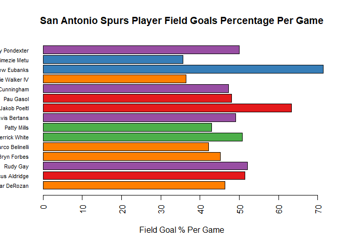

## Questions

### 1. Harry Potter

  Loading Libraries
  

```r
library(tidyr)
library(rvest)
```

```
## Loading required package: xml2
```

```r
library(dplyr)
```

```
## 
## Attaching package: 'dplyr'
```

```
## The following objects are masked from 'package:stats':
## 
##     filter, lag
```

```
## The following objects are masked from 'package:base':
## 
##     intersect, setdiff, setequal, union
```

a. View the Table data at the link below:

```r
http://www.imdb.com/title/tt1201607/fullcredits?ref_=tt_ql_1
```

b. Scraping the Cast information from the URL above:

```r
cast <- read_html("http://www.imdb.com/title/tt1201607/fullcredits?ref_=tt_ql_1")
cast_list <- cast %>% html_nodes(xpath = '//*[@id="fullcredits_content"]/table[3]') %>% html_table(header = TRUE)
cast_df <- cast_list[[1]]
```

c. Cleaning up the Table

  * Labeling and Removing the Unnecessary Columns

```r
colnames(cast_df) <- c("1", "Actor", "2", "Character")
cast_df = select(cast_df, "Actor", "Character")
```

  * Update Mr. Warwick's Character Name

```r
cast_df$Character[10] <- 'Griphook / Professor Filius Flitwick'
```

  * Removing the row that contains "Rest of cast listed alphabetically" which is found at row 92

```r
cast_df <- cast_df[-c(92), ]
```

d. Splitting Actor Name into First and Last Names

```r
cast_df <- cast_df %>% separate(Actor, c("FirstName", "SurName"), "(?=[^ ]+$)", extra = "merge" )
```

e. Present the first 10 rows

```r
head(cast_df, 10)
```

```
##    FirstName   SurName                            Character
## 1     Ralph    Fiennes                       Lord Voldemort
## 2   Michael     Gambon           Professor Albus Dumbledore
## 3      Alan    Rickman              Professor Severus Snape
## 4    Daniel  Radcliffe                         Harry Potter
## 5    Rupert      Grint                          Ron Weasley
## 6      Emma     Watson                     Hermione Granger
## 7    Evanna      Lynch                        Luna Lovegood
## 8  Domhnall    Gleeson                         Bill Weasley
## 9  Clémence      Poésy                       Fleur Delacour
## 10  Warwick      Davis Griphook / Professor Filius Flitwick
```

### 2. SportsBall

  Loading Libraries
  

```r
library(tidyr)
library(rvest)
library(dplyr)
```

a. View the Table data at the link below:

```r
http://www.espn.com/nba/team/stats/_/name/sa/san-antonio-spurs
```

b. Scraping the Shooting Statistic from the URL above:

```r
shoots <- read_html("http://www.espn.com/nba/team/stats/_/name/sa/san-antonio-spurs")
shoots_list <- shoots %>% html_nodes(xpath = '//*[@id="fittPageContainer"]/div[2]/div[5]/div[1]/div/article/div/section/section/section[2]/table') %>% html_table(fill = TRUE)
shoots_df <- shoots_list[[1]]
```

c. Cleaning up the Table


```r
# Remove Unwanted and Unnecessary Columns and Rows
shoots_df <- shoots_df[-c(1), ]
shoots_df <- shoots_df[-c(18), ]
shoots_df <- shoots_df[ , -c(15:258) ]
shoots_df <- shoots_df[-c(17), ]
shoots_df <- shoots_df[-c(33), ]

# Create a vector with the names of Players
name_vector <- as.vector(shoots_df$X1[2:16])

# Remove the Rows with the Names of the Players, I will add these back soon
shoots_df <- shoots_df[-c(1:16), ]

# Create a vector using the column names, which are not yet columns
col_vector <- as.character(shoots_df[1,])
# Append Name to the beginning of the vector made above
col_vector <- append(col_vector, "Name", after = 0)
shoots_df <- shoots_df[-c(1), ]

# Add the name vector as several rows to be row headings to the data frame
shoots_df <- cbind(name_vector, shoots_df)

# Add the column vector to data frame to be the column headings
colnames(shoots_df) <- col_vector

# Separate Team Position out into a column
shoots_df <- shoots_df %>% separate(Name, c("Name", "Position"), "(?=[^ ]+$)", extra = "merge")

# convert all but Name and Position to Numeric
shoots_df[3:16] <- sapply(shoots_df[3:16], as.numeric)
sapply(shoots_df, class)
```

```
##        Name    Position         FGM         FGA         FG%         3PM 
## "character" "character"   "numeric"   "numeric"   "numeric"   "numeric" 
##         3PA         3P%         FTM         FTA         FT%         2PM 
##   "numeric"   "numeric"   "numeric"   "numeric"   "numeric"   "numeric" 
##         2PA         2P%      SC-EFF      SH-EFF 
##   "numeric"   "numeric"   "numeric"   "numeric"
```

```r
# First 10 values of the data frame
head(shoots_df, 10)
```

```
##                  Name Position FGM  FGA  FG% 3PM 3PA  3P% FTM FTA  FT% 2PM
## 21     DeMar DeRozan        SG 8.3 17.9 46.3 0.1 0.8 17.1 4.7 5.7 82.2 398
## 22 LaMarcus Aldridge         C 8.3 16.1 51.4 0.1 0.4 21.1 4.5 5.3 84.9 434
## 23          Rudy Gay        SF 5.7 11.0 52.1 1.0 2.5 40.2 1.8 2.0 86.4 203
## 24       Bryn Forbes        SG 4.5 10.1 45.1 2.2 5.2 42.5 0.8 0.9 88.0 124
## 25   Marco Belinelli        SG 3.7  8.8 42.1 2.0 5.1 39.5 1.6 1.8 91.1  86
## 26     Derrick White        PG 3.8  7.4 50.8 0.7 1.9 36.9 1.5 2.0 77.0 134
## 27       Patty Mills        PG 3.3  7.7 43.0 1.8 4.5 39.8 1.2 1.5 85.7  79
## 28     Davis Bertans        SF 2.8  5.6 49.1 2.1 4.4 47.8 0.5 0.6 85.7  32
## 29      Jakob Poeltl         C 2.2  3.4 63.3 0.0 0.0  0.0 0.8 1.4 55.2 107
## 30         Pau Gasol         C 1.6  3.4 48.0 0.2 0.5 50.0 1.0 1.5 71.9  31
##    2PA  2P% SC-EFF SH-EFF
## 21 834 47.7  1.198   0.47
## 22 833 52.1  1.311   0.52
## 23 365 55.6  1.294   0.57
## 24 259 47.9  1.204   0.56
## 25 189 45.5  1.253   0.53
## 26 241 55.6  1.317   0.56
## 27 166 47.6  1.258   0.55
## 28  60 53.3  1.442   0.68
## 29 169 63.3  1.485   0.63
## 30  65 47.7  1.333   0.51
```

d. Creating a Bar Chart

```r
colors <- RColorBrewer::brewer.pal(length(unique(shoots_df$Position)), name = "Set1")
shoots_df$color <- colors[as.factor(shoots_df$Position)]
par(las=2)
barplot(shoots_df$`FG%`, main = "San Antonio Spurs Player Field Goals Percentage Per Game", horiz = TRUE, xlab = "Field Goal % Per Game", col = shoots_df$color, names.arg = shoots_df$Name, cex.names = 0.7)
```

<!-- -->
